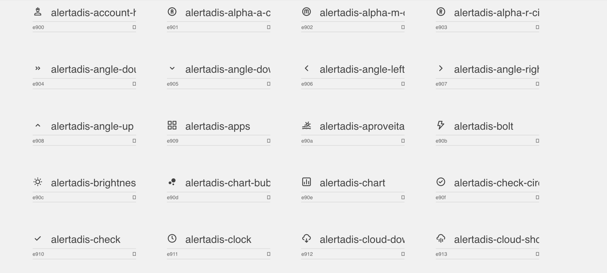

# AlertaDis Copel Distribuição Icon Fonts

(C) Copyright SIMEPAR - Sistema Meteorológico do Paraná

## What is it about?
AlertaDis Copel Distribuição Icon Fonts is a package that has icon fonts for AlertaDis project with Copel Distribuição
## Get Started

### Installation
Import the icons from: 
```
<link rel="stylesheet" href="https://simepar.github.io/alertadis-icons/style.css">  
```

### HTML
Using the span tag you can add the icons:

```
<span class="icon-alertadis-<icon_class>"></span>
```

### Icon Classes

